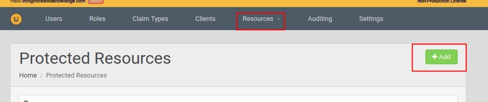
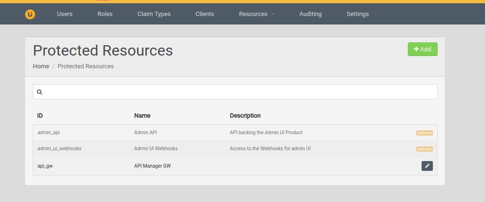

# MS Identity Server 4.0 as Key Manager for APIM

## Setting up

### Configurations in API Manager

1. Build the project and get `APIMCustomKeyManager/target/APIMCustomKeyManager-1.0.0.jar`. Copy that into `repository/components/lib`.
 
2. In api-manager.xml

```xml
    <APIKeyManager>
        <KeyManagerClientImpl>com.wso2.services.apim.extension.IdentityExpressAsKMImpl</KeyManagerClientImpl>
        <Configuration>
            <ServerURL>https://localhost:${mgt.transport.https.port}${carbon.context}services/</ServerURL>
            <Username>${admin.username}</Username>
            <Password>${admin.password}</Password>
            <TokenURL>https://${carbon.local.ip}:${https.nio.port}/token</TokenURL>
            <RevokeURL>https://${carbon.local.ip}:${https.nio.port}/revoke</RevokeURL>
        </Configuration>
    </APIKeyManager>
```

3. Add following additional jars to `repository/components/lib` folder.

* gson-fire-1.8.0.jar
* logging-interceptor-2.7.5.jar
* okhttp-2.7.5.jar
* okio-1.6.0.jar
* threetenbp-1.3.5.jar

Note: 

They can be found in .m2 in locations below after building the project

```
${m2-repo-home}/io/gsonfire/gson-fire/1.8.0/gson-fire-1.8.0.jar
${m2-repo-home}/com/squareup/okhttp/logging-interceptor/2.7.5/logging-interceptor-2.7.5.jar
${m2-repo-home}/com/squareup/okhttp/okhttp/2.7.5/okhttp-2.7.5.jar
${m2-repo-home}/com/squareup/okio/okio/1.6.0/okio-1.6.0.jar
${m2-repo-home}/org/threeten/threetenbp/1.3.5/threetenbp-1.3.5.jar
```

### Configurations in IS4

* Login via Admin API and select `Resources` -> `Protected Resources`.
* Click `Add` and specify the `Id` as "api_gw" and `Display Name` API Manager GW.



* Finally the resource would look like below



## Troubleshooting

Add below logging configuration in `repository/conf/log4j.properties` file.

```properties
log4j.logger.com.wso2.services.apim.extension=DEBUG
```