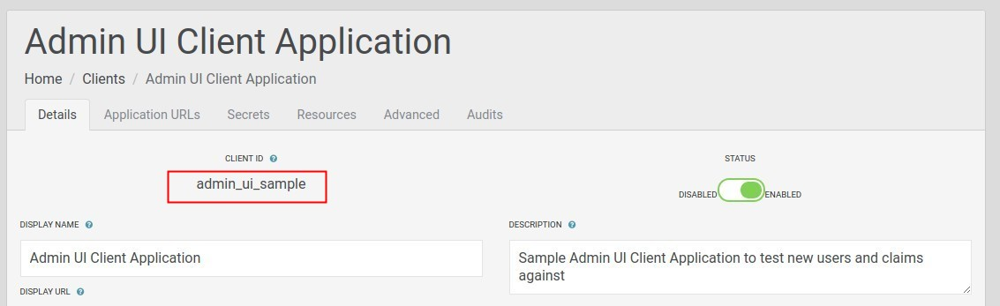
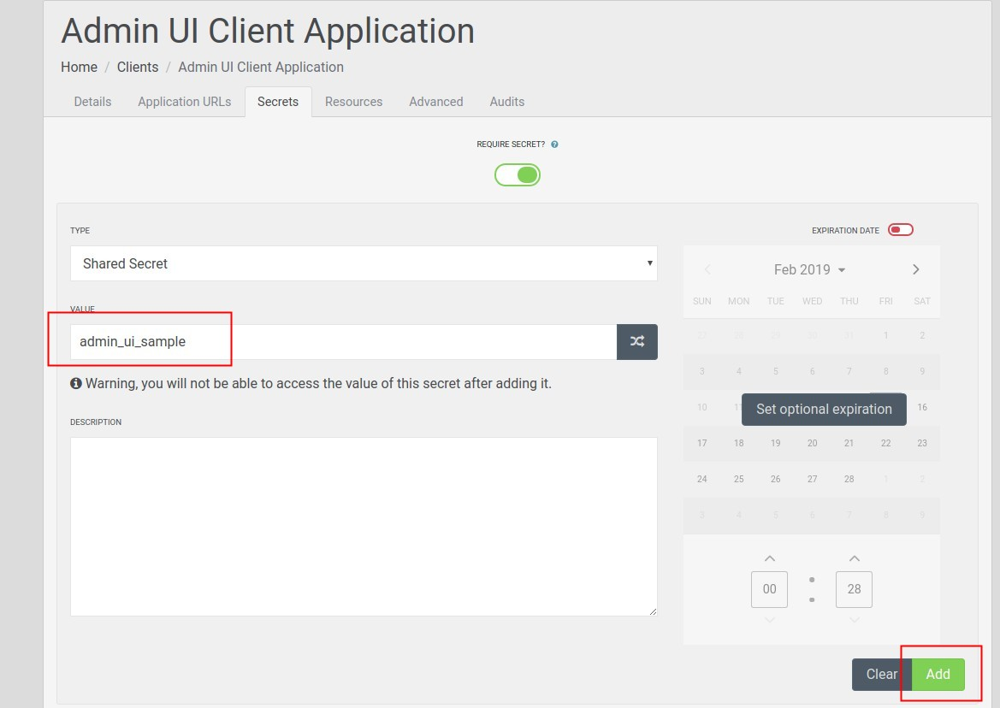
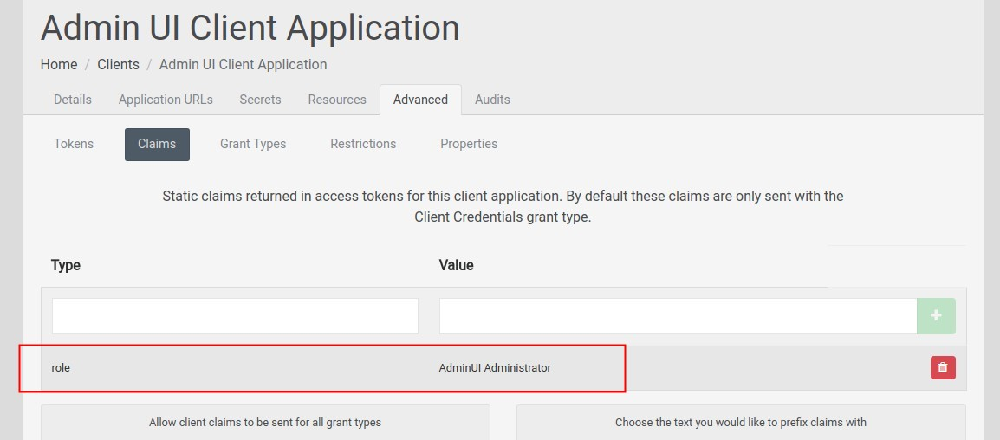
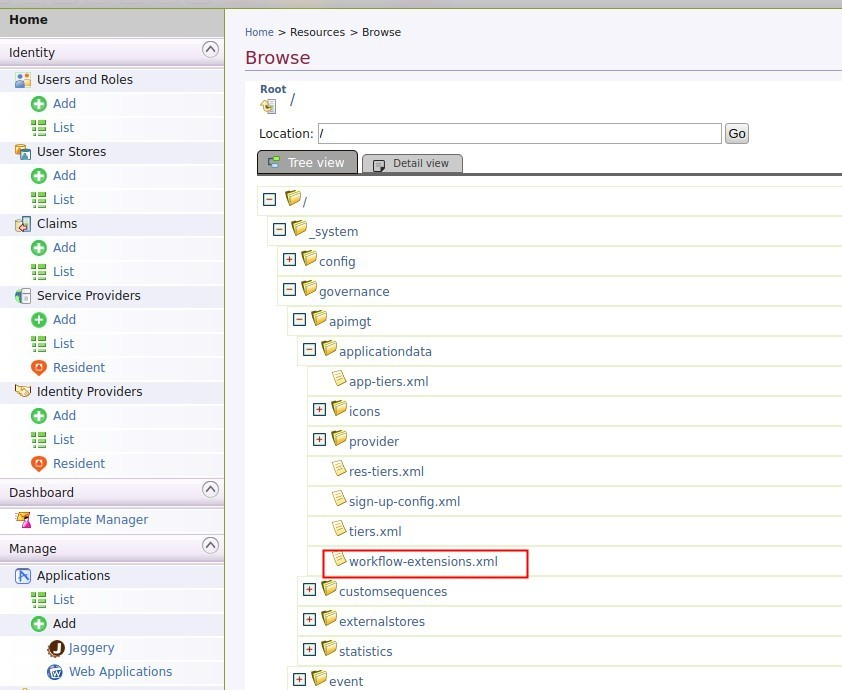

# Integrate Identity Server 4.0 as a Third Party Key Manager for WSO2 API Manager

## Setting up

### Configurations in Identity Server 4.0 

1. Create an application to in Identity Server 4.0. This will be used by API Manager to access the Admin APIs.



2. Make sure to provide a secret as well.



3. In `Advanced` -> `Claims` add a claim `role` with value `AdminUI Administrator`.



### Configurations in API Manager

1. Build the project and get `impl/target/org.wso2.apimgt.keymgt.is4-1.0.0.jar`. Copy that into `repository/components/dropins`.
 
2. In api-manager.xml, configure the key manager class name with details of IS4. You need to specify the clientId and 
secret which was used when creating the application in the IS4.

```xml
    <APIKeyManager>
        <KeyManagerClientImpl>org.wso2.apimgt.keymgt.is4.IdentityServer4AsKMImpl</KeyManagerClientImpl>
        <Configuration>
            <TokenAPI>http://ids:5003/connect/token</TokenAPI>
            <AdminAPI>http://localhost:5001</AdminAPI>
            <IntrospectionAPI>http://ids:5003/connect/introspect</IntrospectionAPI>
            <ClientId>admin_ui_sample</ClientId>
            <ClientSecret>admin_ui_sample</ClientSecret>
        </Configuration>
    </APIKeyManager>
```

3. Add following additional jars to `repository/components/lib` folder.

* gson-fire-1.8.0.jar
* logging-interceptor-2.7.5.jar
* okhttp-2.7.5.jar
* okio-1.6.0.jar
* threetenbp-1.3.5.jar

Note: 

They can be found in .m2 in locations below after building the project

```
${m2-repo-home}/io/gsonfire/gson-fire/1.8.0/gson-fire-1.8.0.jar
${m2-repo-home}/com/squareup/okhttp/logging-interceptor/2.7.5/logging-interceptor-2.7.5.jar
${m2-repo-home}/com/squareup/okhttp/okhttp/2.7.5/okhttp-2.7.5.jar
${m2-repo-home}/com/squareup/okio/okio/1.6.0/okio-1.6.0.jar
${m2-repo-home}/org/threeten/threetenbp/1.3.5/threetenbp-1.3.5.jar
```

4. Setup the key validation handler class in the api-manager.xml as follows.

```xml
<!--KeyValidationHandlerClassName>org.wso2.carbon.apimgt.keymgt.handlers.DefaultKeyValidationHandler</KeyValidationHandlerClassName-->
	<KeyValidationHandlerClassName>org.wso2.apimgt.keymgt.is4.token.IS4KeyValidationHandler</KeyValidationHandlerClassName>
```

5. Add the following handler at the beginning of the synapse handlers of the API in velocity.xml.
(<AM_HOME>/repository/resources/api_templates/velocity_template.xml). It needs to be added after `<handlers xmlns="http://ws.apache.org/ns/synapse">`
and before `#foreach($handler in $handlers)`.


```xml
      <handler class="org.wso2.apimgt.keymgt.is4.handler.InjectIS4ResourceHandler"/>
```

After it is added:

```xml
...
<handlers xmlns="http://ws.apache.org/ns/synapse">
      <handler class="org.wso2.apimgt.keymgt.is4.handler.InjectIS4ResourceHandler"/> <!-- <=== --> 
#foreach($handler in $handlers)
<handler xmlns="http://ws.apache.org/ns/synapse" class="$handler.className">
    #if($handler.hasProperties())
    #set ($map = $handler.getProperties() )
...
```

6. Configure the workflow extensions in workflow-extensions.xml from API Manager carbon console.



```xml
<WorkFlowExtensions>
...
    <!--ProductionApplicationRegistration executor="org.wso2.carbon.apimgt.impl.workflow.ApplicationRegistrationSimpleWorkflowExecutor"/-->
    <ProductionApplicationRegistration executor="org.wso2.apimgt.keymgt.is4.workflow.IS4ApplicationRegistrationWorkflow"/>
    
    <!--SandboxApplicationRegistration executor="org.wso2.carbon.apimgt.impl.workflow.ApplicationRegistrationSimpleWorkflowExecutor"/-->
    <SandboxApplicationRegistration executor="org.wso2.apimgt.keymgt.is4.workflow.IS4ApplicationRegistrationWorkflow"/>
    
    <!--SubscriptionCreation executor="org.wso2.carbon.apimgt.impl.workflow.SubscriptionCreationSimpleWorkflowExecutor"/-->
    <SubscriptionCreation executor="org.wso2.apimgt.keymgt.is4.workflow.IS4SubscriptionCreationWorkflow"/>
    
    <!--SubscriptionDeletion executor="org.wso2.carbon.apimgt.impl.workflow.SubscriptionDeletionSimpleWorkflowExecutor"/-->
    <SubscriptionDeletion executor="org.wso2.apimgt.keymgt.is4.workflow.IS4SubscriptionDeletionWorkflow"/>
...
</WorkFlowExtensions>
```

## Troubleshooting

Add below logging configuration in `repository/conf/log4j.properties` file.

```properties
log4j.logger.org.wso2.apimgt.keymgt.is4=DEBUG
```