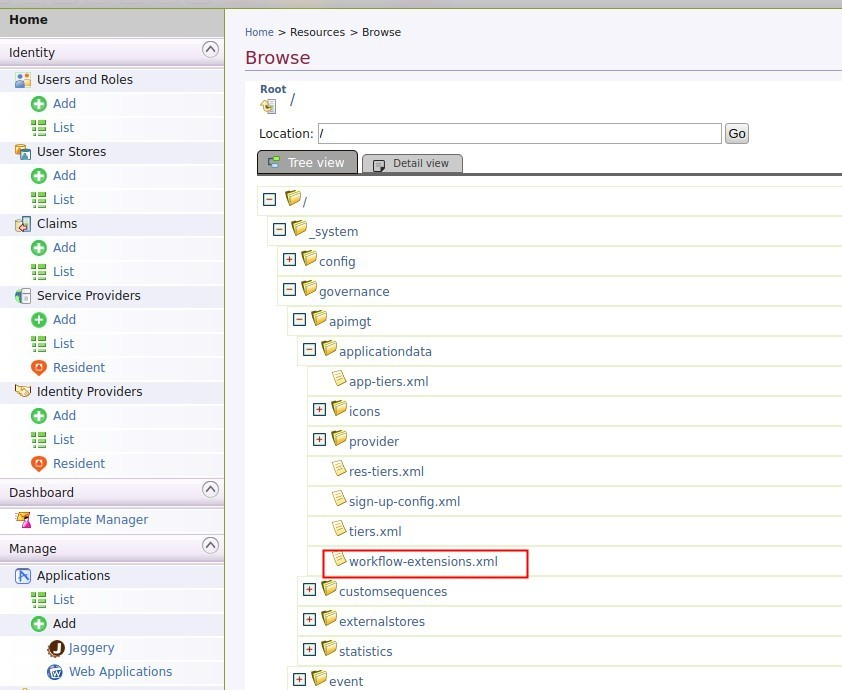

# MS Identity Server 4.0 as Key Manager for APIM

## Setting up

### Configurations in API Manager

1. Build the project and get `APIMCustomKeyManager/target/APIMCustomKeyManager-1.0.0.jar`. Copy that into `repository/components/lib`.
 
2. In api-manager.xml

```xml
    <APIKeyManager>
        <KeyManagerClientImpl>com.wso2.services.apim.extension.IdentityServer4AsKMImpl</KeyManagerClientImpl>
        <Configuration>
            <TokenAPI>http://ids:5003/connect/token</TokenAPI>
            <AdminAPI>http://localhost:5001</AdminAPI>
            <IntrospectionAPI>http://ids:5003/connect/introspect</IntrospectionAPI>
            <ClientId>admin_ui_sample</ClientId>
            <ClientSecret>admin_ui_sample</ClientSecret>
            <Username>info@rocksolidknowledge.com</Username>
            <Password>Password123!</Password>
        </Configuration>
    </APIKeyManager>
```

3. Add following additional jars to `repository/components/lib` folder.

* gson-fire-1.8.0.jar
* logging-interceptor-2.7.5.jar
* okhttp-2.7.5.jar
* okio-1.6.0.jar
* threetenbp-1.3.5.jar

Note: 

They can be found in .m2 in locations below after building the project

```
${m2-repo-home}/io/gsonfire/gson-fire/1.8.0/gson-fire-1.8.0.jar
${m2-repo-home}/com/squareup/okhttp/logging-interceptor/2.7.5/logging-interceptor-2.7.5.jar
${m2-repo-home}/com/squareup/okhttp/okhttp/2.7.5/okhttp-2.7.5.jar
${m2-repo-home}/com/squareup/okio/okio/1.6.0/okio-1.6.0.jar
${m2-repo-home}/org/threeten/threetenbp/1.3.5/threetenbp-1.3.5.jar
```

4. Configure the workflow extensions in workflow-extensions.xml from API Manager carbon console.



Comment out the `<ProductionApplicationRegistration>` and `<SandboxApplicationRegistration>` elements and add below.

```xml
<WorkFlowExtensions>
...
    <!--ProductionApplicationRegistration executor="org.wso2.carbon.apimgt.impl.workflow.ApplicationRegistrationSimpleWorkflowExecutor"/-->
    <ProductionApplicationRegistration executor="com.wso2.services.apim.extension.workflow.IS4ApplicationRegistrationWorkflow"/>
    
    <!--SandboxApplicationRegistration executor="org.wso2.carbon.apimgt.impl.workflow.ApplicationRegistrationSimpleWorkflowExecutor"/-->
    <SandboxApplicationRegistration executor="com.wso2.services.apim.extension.workflow.IS4ApplicationRegistrationWorkflow"/>
...
</WorkFlowExtensions>
```
5. Setup the key validation handler class in the api-manager.xml as follows.

```xml
<!--KeyValidationHandlerClassName>org.wso2.carbon.apimgt.keymgt.handlers.DefaultKeyValidationHandler</KeyValidationHandlerClassName-->
	<KeyValidationHandlerClassName>com.wso2.services.apim.extension.token.IS4KeyValidationHandler</KeyValidationHandlerClassName>
```
6. Add the following handler at the beginning of the synapse handlers of the API.

```xml
<handler class="com.wso2.services.apim.extension.handler.InjectIS4ResourceHandler"/>
```

## Troubleshooting

Add below logging configuration in `repository/conf/log4j.properties` file.

```properties
log4j.logger.com.wso2.services.apim.extension=DEBUG
```